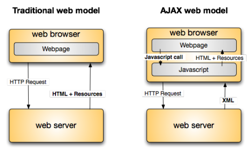
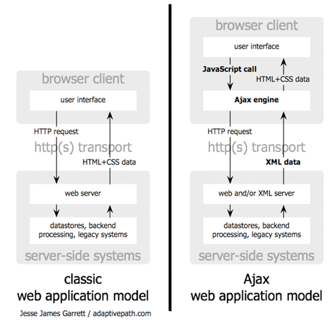

# JQuery Ajax.

Asynchronous Javascript and XML (Ajax).

* [Asynchronous](http://goo.gl/e3qOB).  
	* Non blocking.
	* We've, mostly, been using methods that are synchronous.
	* Typically handled with callback handlers, _more later_.

* XML  
	* XML (X Markup Language), based on [SGML](http://goo.gl/RB1JSP).
	* Older, less used format for representing Resources.
	* Typically we use JSON to represent resources.







#### XMLHttpRequest
This is the underlying Javascript Object, _built into the browser_, that enables Ajax. Typically, we will see this wrapped inside of library specific function that will add functionality and remove browser inconsistencies. 

We will be using the $.ajax function, that wraps XMLHttpRequest, provided by JQuery.

* [XMLHttpRequest](https://developer.mozilla.org/en-US/docs/Web/API/XMLHttpRequest)

## Objectives.
1. Create a Standalone Javascript Client implemented using Ajax.  
	This is a Single Page Application (SPA) that will use a JSON API to 	persist data.
2. Use the JQuery Ajax methods.
3. Understand the asynchronous nature of Ajax.
3. Understand how JQuery Ajax global handlers ar typically used.
4. Understand how to create resources using Ajax Post.
	
## Startup the Rails JSON Articles API/Service.
 Make sure you have the Articles API running on port 3000.

(clone only if you don't already have it)
1.  ``git clone git@github.com:ga-wdi-boston/wdi_6_rails_lab_api.git``

2.  ``cd wdi_6_rails_lab_api``


3.  This will seed your DB with Lorem Ipsum data.  
	``rake db:reset ``

4. In Chrome go to http://localhost:3000 and make sure you
  get back a JSON representation of all the articles.
  

## Refer to this Finished SPA
__This repository will contain all the finished code that we are going to write in this lesson.__

__Refer to it if your stuck__

This Finished SPA will contain all the examples below.

## Demo - Create a new SPA to view all the Articles

* Create a new __Directory__, named _articles_spa_ that will contain all the Client/Browser code (_javascript_, _css_ and _html_) for this SPA.  

	* Change into this articles	_spa directory  
		``cd article_spa``  
	* Make a js, images and css directory.  
	* Copy jquery.js and simple.css from the this repo into these directories.
	
* Create this index.html.
	
```
<html>
  <head>
    <link href="css/simple.css" rel="stylesheet" type="text/css" media="all">
    <script src='js/jquery.js'></script>
    <script src='js/article.js'></script>    
    <script src='js/article_list.js'></script>    
    <script src='js/main.js'></script>    
  </head>
  <body>
    <h3>Article Blog Ajax Get</h3>
    <div id='container'>
      <button id='get-articles'>Get Articles</button>
      <ul id='articles'>Articles
      </ul>
    </div>
  </body>
</html>```	

*  Run a HTTP server on port 5000.   
    ``ruby -run -e httpd . -p5000``  
    
    Note: I create a bash alias for this.
    
    ```
     alias rubys="ruby -run -e httpd . -p5000"
    ```
  
    This will run the WEBrick server on port 5000. This is used ONLY to serve up 
    the html/css and javascript for this SPA.  
  
* Create a file js/main.js and copy this into it.

```
$(document).ready(function(){
  Blog.ArticleList.init('#get-articles', '#articles');
})
```

* Create a file js/article.js and this code into it.

```
var Blog = Blog || {};

Blog.Article = function(id, title, body){
  this.id = id;
  this.title = title;
  this.body = body;
};

Blog.Article.prototype = {
  showView: function(){
    var articleHTML = '<li id=article_' + this.id + '>' + this.title;
    articleHTML += '<div>' + this.body + '</div>';
    articleHTML += '</li>';

    return articleHTML;
  }
};
```

* Create a file js/article_list.js and copy this into it.
	
```
var Blog = Blog || {};

Blog.ArticleList = {
  articlesCallbackHandler: function(articles){
   var articlesHTML = '',
   article;

    // Build the HTML for each Article
    for(var i = 0; i < articles.length; i++){
      article = new Blog.Article(articles[i].id, articles[i].title, articles[i].body)
      articlesHTML += article.showView();
    };

    // Clear list of articles.
    this.articlesListElem.empty();
    // Fill in the article list
    this.articlesListElem.append(articlesHTML);
  },
  getArticles: function(){
  // Retrieve all the articles
    $.ajax({
      url: "http://localhost:3000/articles",
      type: "GET",
      dataType: 'json',
    }).success(this.articlesCallbackHandler.bind(this));
  },
  init: function(getArticlesID, articlesListID){
    this.getArticlesButton = $(getArticlesID);
    this.articlesListElem = $(articlesListID);

    // Set the click handler
    this.getArticlesButton.on('click', this.getArticles.bind(this));

    // Simulate a user click event. Will get all the articles
    this.getArticlesButton.trigger('click');
  }

};
```

Instructor will walk through the above. 

## Lab 1

Go to the [JQuery Ajax](http://api.jquery.com/jquery.ajax/) page to go over the $.ajax method used in the getArticles function above.

* What are valid values. for the dataType property? 
* What if you leave out the datatype property?
* What are the valid values for the type property?
* Can we leave the 'http://' out of the url property? 
* What is in the rails server log when it's sent an Ajax request for all the articles?
* Stop the rails API server and reload this page, what happens? Look in the Chrome inspector.
* Use _beforeSend_ property to disable the "Get Articles" button.
* Use _complete_ property to enable the "Get Articles" button.
* Use the _error_ property to create an alert with the text of the error. Then force and error.

The above code is in __js/get_articles_lab1.js__

## Demo - Async Functions and Methods.

In the above code we are sending __Asynchronous__ requests to the server. This means that as soon as we send the request we return from the $.ajax method.

__We do not wait for the response__.

This can cause problems if you don't keep in mind this async type of behavior.

Lets see how we can in trouble. 

#### In the js/articles_list.js

1. Create a global article count and set it 0.  
2. Show the number of articles on the page.
3. Calculate the number of articles returned by the server in the success callback.


```
var Blog = Blog || {};

Blog.ArticleList = {
  articlesCallbackHandler: function(articles){
	...
    // 3. Calculate the number of articles returned by the server in the success callback.    
    this.count = articles.length;
	...
  },
  getArticles: function(){
    this.count = 0;
    
    // Retrieve all the articles
    $.ajax({... });

	// 2. Show the number of articles on the page.
    this.articleCountElem.html("<p> " + this.count + " Articles</p>");
  },
  init: function(getArticlesID, articlesListID, articleCountID){
    ...
    this.articleCountElem = $(articleCountID);
    // 1. Create a global article and set it to 0
    this.count = 0; 
	... 
  }

};

```

Don't forget to update the init method in lib/main.js 

  ```
  Blog.ArticleList.init('#get-articles', '#articles', '#article-count');

  ```
  

## Lab 2

* Why doesn't this work? 

	Put breakpoints where we set the length and construct the HTML to show the length.

* Watch this. [Help, I'm stuck in an event-loop](http://vimeo.com/96425312)


## Demo - Async Functions and Methods (continued)

To fix this we are going to use Promises, aka Deferred, objects.

Without going into a lot of detail about Promises. We will use the __done__ callback handlers that are implemented using Promises.

* Create a new file, js/get_articles_async_fixed.js

```
 var getArticles = function(){
    // Retrieve all the articles
    $.ajax({
        url: "http://localhost:3000/articles",
        type: "GET",
        dataType: 'json'
      })
    .done(articlesCallbackHandler)
    .done(function(){
      // set the article count
      $('#get-articles').after("<p> " + articleCount + " Articles</p>");
    });
  }
```

When defined with _done_ above:  
* _A Promise is created that will execute the articlesCallbackHandler_.  
* _Another Promise is created that will execute the anon function to set the article count._


When the Ajax request responds:  
* _The Promise will execute the articlesCallbackHandler_.  
* _The Promise will execute the anon function._


##### Always use the below methods!

From [Jquery.ajax](http://api.jquery.com/jquery.ajax/)

* __jqXHR.done(function( data, textStatus, jqXHR ) {});__  

	_An alternative construct to the success callback option_, the .done() method replaces the deprecated jqXHR.success() method. 

* __jqXHR.fail(function( jqXHR, textStatus, errorThrown ) {});__  

	_An alternative construct to the error callback option_, the .fail() method replaces the deprecated .error() method.

* jqXHR.always(function( data|jqXHR, textStatus, jqXHR|errorThrown ) { });  

	_An alternative construct to the complete callback option_, the .always() method replaces the deprecated .complete() method.

	In response to a successful request, the function's arguments are the same as those of .done(): data, textStatus, and the jqXHR object. For failed requests the arguments are the same as those of .fail(): the jqXHR object, textStatus, and errorThrown.

* jqXHR.then(function( data, textStatus, jqXHR ) {}, function( jqXHR, textStatus, errorThrown ) {});

	Incorporates the functionality of the .done() and .fail() methods, allowing (as of jQuery 1.8) the underlying Promise to be manipulated.


## Demo - Global Handlers

Ajax global handlers are fired during different periods in the lifecycle of an Ajax request. We are going to use these handlers to show a spinner and disable controls while we are sending and waiting for an Ajax request/response.

* Copy the images/ajax-loader.gif to you images directory. 
* Add this to index.html in the head section.

```
	<script src='js/ajax_globals_done.js'></script>
```

* Then add this to the index.html inside the container div.  

```
	
	<!-- Ajax Loading Spinner-->
	<div id="ajaxSpinnerContainer" class='centered'>
	  
	</div>    
```

* Create a new file js/ajax_globals.js and add this code to it:

```
$(document).ready(function(){

  // Fires at beginning of Ajax Request
  $(document).ajaxStart(function(){

    //Disable the get all articles button.
    $('#get-articles').prop('disabled', true);

    // Fires when Ajax Request starts
    $("#ajaxSpinnerImage").show();

  }).ajaxSend(function(event, xhr, options){
    
    //Clear the list of articles here?
    if(options.type !== 'POST'){
      $('#articles').html('');
    }

  }).ajaxComplete(function(event, xhr, options){

  }).ajaxStop(function(){

    // Fires when Ajax Request is done
    $("#ajaxSpinnerImage").hide();

    //Disable the get all articles button.
    $('#get-articles').prop('disabled', false);

    })
  .ajaxError(function( event, request, settings ) {

    // Fires when an Ajax Error Occurs
    $( "#msg" ).append( "<p>Error requesting page " + settings.url + "<p>" );
  });
  
});

```

## Demo - Create Artices using Ajax POST.

Modify index.html so that it can create a new article.

```
 <script src='js/post_article.js'></script> 
```

```
  <!-- Create a new Article -->
      <form id='new-article' action='http://localhost:3000/articles'>
      <input type='text' name='title'placeholder="Enter new title">
        <input type='textarea' name='body' placeholder="Enter new contents">
        <input type='submit' value='Create Article'>
      </form>
```

Create a js/post_article.js.

```
$(document).ready(function(){

  var articleHTML = function(article){
    var html = '<li id=article_' + article.id + '>';
    html += article.title;
    html += '<div>' + article.body + '</div>';
    html += '</li>';
    return html;
  },
  getArticle = function(article){
    // Add the article to the article list
    $('#articles').append(articleHTML(article));
  },
  createArticleCallbackHandler = function(event){
    // New article form
    var $form = $(event.target),
    $title = $form.find("input[name='title']"),
    $body = $form.find("input[name='body']"),
    // Get the form action
    action = $form.attr('action'),
    requestObj = {article:  {title: $title.val(), body: $body.val()}};

    event.preventDefault();
      
    // Create and send a POST request
    $.ajax({
      type: "POST",
      url: 'http://localhost:3000/articles', 
      data: requestObj,
      dataType: 'json'
    }).done(getArticle);
  };

  // Set up click handler for form submit
  $('#new-article').on('submit', createArticleCallbackHandler);

});

```

The above code is in __js/post_article_done.js__

## Demo - Same app but
we'll use Rails to provide all of the javascript.

This Rails app is __both__ the JSON API and will provide the HTML, CSS and Javasrcipt.

I have copies the CSS, HTML and Javascript to this rails app.

[Same App using Rails](https://github.com/ga-wdi-boston/wdi_7_rails_demo_ajax)

* fork and clone https://github.com/ga-wdi-boston/wdi_7_rails_demo_ajax
* Look at the schema, same as the rails api schema.
* Look at the HomeController. It only provides the HTML for the app.
* The Javascript is in the app/assets/javascript directory. This is served up by the Rails _asset pipeline_.
   
## Refactor
1. Refactor the Ajax GET to use Javascript namespaces, classes, bind, etc.
2. Refactor Ajax Post to use Javascript classes, bind, etc.

#### Example (Ajax GET Refactored):

  ``ruby -run -e httpd . -p5000``
  Go to localhost:5000/adv_get.html


#### Example (Ajax POST Refactored):
  ``ruby -run -e httpd . -p5000``
  Go to localhost:5000/manage_articles.html
  

  

